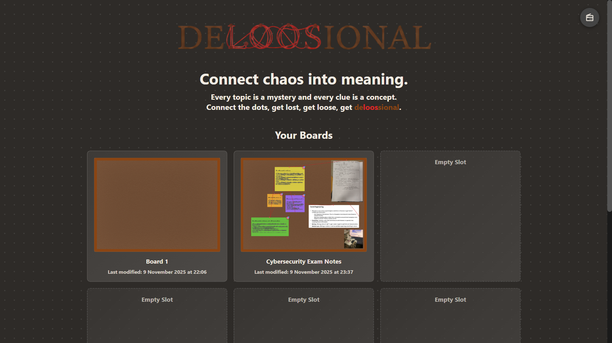
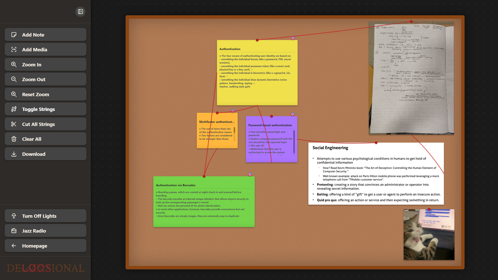

<div align="center">
  
</div>

# Deloosional

A detective-themed investigation board application that transforms studying into an interactive investigation. No frameworks, no backend, no dependencies beyond the browser—just pure client-side code solving the case of ineffective note-taking.



## Project Overview

Deloosional is a hackathon project that reimagines the traditional corkboard investigation aesthetic as a digital learning tool. Users create visual investigation boards with sticky notes, media attachments, and connection strings to map relationships between concepts. The application leverages vanilla JavaScript and modern browser APIs to deliver a zero-build, framework-free experience.

The case isn't closed until all the clues connect.



## Technical Architecture

### Core Technologies
- **Vanilla JavaScript (ES6+)**: Zero framework overhead with modern syntax
- **HTML5 Canvas API**: Real-time rendering of connection lines between elements
- **CSS3 Animations**: Hardware-accelerated transforms for drag operations and UI transitions
- **Web Storage API (localStorage)**: Client-side data persistence with JSON serialization
- **File API**: Base64 image encoding for media attachments without server storage
- **html2canvas (CDN)**: High-resolution board export to PNG via DOM-to-canvas rendering

### Technical Features

#### Multi-Board State Management
- Up to 6 concurrent investigation boards with independent state trees
- Board preview generation via programmatic thumbnail rendering
- localStorage-based persistence layer with automatic serialization/deserialization
- Collision-free board deletion and creation with timestamp-based unique identifiers

#### Canvas-Based Connection System
- Real-time Bézier curve rendering for visual connections between elements
- Connection point hit detection with proximity-based activation
- Dynamic line color and stroke width with anti-aliasing
- Toggle visibility for connection layer without state destruction
- Implements custom line drawing algorithm with drag-to-connect interaction model

#### Transform and Viewport Management
- CSS transform-based zoom (0.25x-3x range) with origin preservation
- Pan functionality via mousedown/mousemove event delegation
- Transform matrix calculations for coordinate space conversion between viewport and board space
- Smooth interpolation for zoom transitions with requestAnimationFrame optimization

#### Drag-and-Drop Physics
- Custom draggable implementation without external libraries
- Collision detection for element boundaries within board constraints
- Z-index management for overlay stacking during drag operations
- Mouse offset calculation to maintain grab point consistency
- Touch event normalization for mobile compatibility (pointer events)

#### Inline Content Editing
- ContentEditable API integration for live note text editing
- Placeholder simulation via CSS pseudo-elements and empty state detection
- Dynamic text contrast adjustment based on background luminance calculation
- Auto-resize sticky notes based on content overflow with min/max constraints

#### Media Annotation System
- Client-side image upload with File Reader API
- Canvas overlay for freehand highlighting and annotation
- Persistent drawing state encoded as canvas data URLs
- Color picker integration with real-time preview
- Brush size controls with adjustable stroke width

#### Audio Integration
- Embedded jazz radio stream with play/pause state management
- Sound effect synchronization for "Case Closed" animation (gavel impact at keyframe 42%)
- Audio element preloading with lazy initialization
- Fallback handling for autoplay policy restrictions

#### Export Functionality
- High-resolution board capture via html2canvas DOM traversal
- Automatic scaling for export quality enhancement
- PNG download generation with programmatic anchor element creation
- Canvas-to-blob conversion for browser download trigger

#### Visual Effects
- "Lights Off" mode with CSS brightness filter applied to body element
- Selective brightness compensation for logo elements
- SVG-based gavel animation with multi-keyframe choreography
- Stamp appearance with cubic-bezier easing and overshoot effect
- Synchronized audio playback at animation impact point

## Feature Breakdown

### Board Management
- **Multi-board system**: Create, rename, delete up to 6 independent boards
- **Auto-generated previews**: Real-time board thumbnails for quick navigation
- **Export to PNG**: High-resolution capture for sharing or archival

### Sticky Notes
- **Four semantic types**: Concept, Fact, Question, Theory (each with distinct visual styling)
- **Custom color picker**: Full RGB spectrum with hex value support
- **Inline editing**: Click-to-edit for title and content fields
- **Drag-and-drop positioning**: Freeform placement anywhere on 2000x1500px board
- **Resizable**: Bottom-right resize handle with proportional constraints

### Media Attachments
- **Image upload**: Support for common image formats (JPEG, PNG, GIF, WebP)
- **Annotation tools**: Freehand drawing with customizable color and brush size
- **Highlight mode**: Visual emphasis for key image regions
- **Drag-and-drop**: Reposition media elements alongside notes

### Red String Connections
- **Visual linking**: Draw connections between any two elements (note-to-note, note-to-media, media-to-media)
- **Connection points**: Four cardinal directions per element for optimal routing
- **Toggle visibility**: Show/hide connection layer without data loss
- **Bulk clear**: Remove all connections with confirmation dialog

### Zoom and Pan
- **Zoom range**: 0.25x to 3x with step increments of 0.25x
- **Pan controls**: Click-and-drag board navigation
- **Reset function**: Instant return to 1x zoom and centered viewport

### Atmospheric Features
- **Jazz radio**: Embedded audio stream toggle for ambiance
- **Lights off mode**: Dim interface for focused late-night investigation sessions
- **Case Closed animation**: Gavel bang with synchronized sound effect as visual feedback

## Technical Requirements

**Browser Compatibility:**
- ES6+ JavaScript support (Chrome 51+, Firefox 54+, Safari 10+, Edge 15+)
- HTML5 Canvas API
- localStorage with minimum 5MB quota
- File API for image handling
- Audio element support

**Optional:**
- Stack Sans Headline font (fallback to system sans-serif if unavailable)
- Download font from [Foss Fonts](https://fossfonts.com/stack-sans-headline) and place in `/fonts` directory

## Installation and Usage

1. Clone the repository
2. Open `index.html` in a modern web browser
3. No build step, no package installation, no server required

```bash
git clone <repository-url>
cd Deloosional
# Open index.html in browser - case opens immediately
```

The evidence is in the code—no compilation needed.

## Project Structure

```
Deloosional/
├── index.html              # Main application shell
├── script.js               # Core application logic and state management
├── gavel-animation.js      # Case closed animation controller
├── styles.css              # Complete stylesheet with animations
├── graphics/               # Logo and background assets
├── audios/                 # Sound effects (gavel, lamp, stamp)
└── app-screenshots/        # Documentation images
```

## Implementation Notes

**State Persistence:** All board data serializes to localStorage with automatic save on every modification. Media attachments convert to base64 data URLs for storage without external dependencies.

**Canvas Rendering:** Connection lines redraw on every state change (note move, zoom, pan) using a clear-and-redraw pattern. Performance remains acceptable due to small element count (typical boards < 50 elements).

**Coordinate Systems:** The application maintains two coordinate spaces—viewport coordinates (screen pixels) and board coordinates (corkboard pixels). Transform matrices convert between spaces for accurate click detection during zoom/pan operations.

## Detective's Notes

This isn't just another note-taking app—it's an investigation toolkit. Every feature serves the purpose of visual thinking: connections reveal patterns, colors categorize information, and spatial arrangement encodes importance.

The mystery of complex topics becomes solvable when you can literally see the connections. Elementary, really.

## License

MIT License - See LICENSE file for details

Copyright (c) 2025 Beray Nil Atabey

---

*"The game is afoot, and every clue deserves a connection."*
